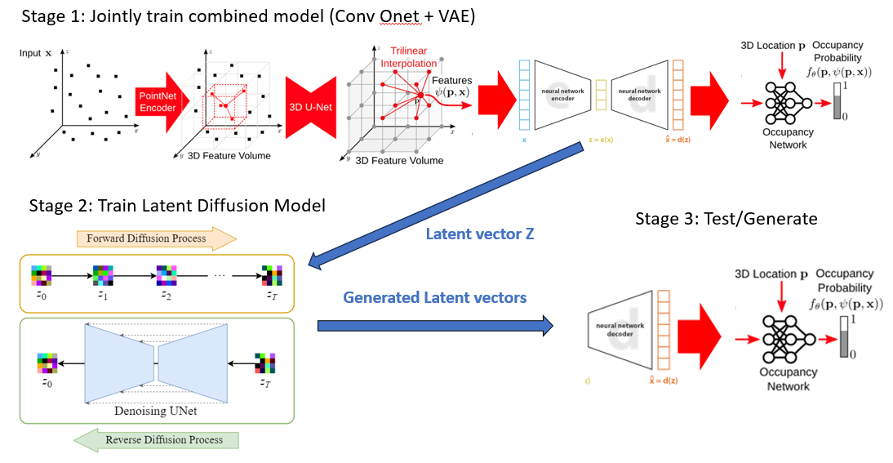

# Creating Novel Scenes using Latent Diffusion Model

<div style="text-align: center">

</div>


## Installation
First you have to make sure that you have all dependencies in place.
The simplest way to do so, is to use [anaconda](https://www.anaconda.com/). 

You can create an anaconda environment called `conv_onet` using
```
conda env create -f environment.yaml
conda activate conv_onet
```
**Note**: you might need to install **torch-scatter** mannually following [the official instruction](https://github.com/rusty1s/pytorch_scatter#pytorch-140):
```
pip install torch-scatter==2.0.4 -f https://pytorch-geometric.com/whl/torch-1.4.0+cu101.html
```

Next, compile the extension modules.
You can do this via
```
python setup.py build_ext --inplace
```

## Demo
First, run the script to get the demo data:
```
bash scripts/download_demo_data.sh
```


### Reconstruct Synthetic Indoor Scene
<div style="text-align: center">

</div>

You can then test on our synthetic room dataset by running: 
```
python generate.py configs/pointcloud/demo_syn_room.yaml
```
## Dataset

To evaluate a pretrained model or train a new model from scratch, you have to obtain the respective dataset.
In this paper, we consider the following dataset:

### Synthetic Indoor Scene Dataset
For scene-level reconstruction, we create a synthetic dataset of 5000
scenes with multiple objects from ShapeNet (chair, sofa, lamp, cabinet, table). There are also ground planes and randomly sampled walls.

You can download our preprocessed data (144 GB) using

```
bash scripts/download_data.sh
```

This script should download and unpack the data automatically into the `data/synthetic_room_dataset` folder.  
**Note**: We also provide **point-wise semantic labels** in the dataset, which might be useful.


## Usage
When you have installed all binary dependencies and obtained the preprocessed data, you are ready to run our pre-trained models and train new models from scratch.

### Mesh Generation
To generate meshes using a trained model, use
```
python generate.py configs/pointcloud/room_3plane_vae.yaml
```

### Evaluation
For evaluation of the models, we provide the script `eval_meshes.py`. You can run it using:
```
python eval_meshes.py CONFIG.yaml
```
The script takes the meshes generated in the previous step and evaluates them using a standardized protocol. The output will be written to `.pkl/.csv` files in the corresponding generation folder which can be processed using [pandas](https://pandas.pydata.org/).

**Note:** We follow previous works to use "use 1/10 times the maximal edge length of the current object’s bounding box as unit 1" (see [Section 4 - Metrics](http://www.cvlibs.net/publications/Mescheder2019CVPR.pdf)). In practice, this means that we multiply the Chamfer-L1 by a factor of 10 for reporting the numbers in the paper.

### Training
Finally, to train a new network from scratch, run:
```
python train.py configs/pointcloud/room_3plane_vae.yaml
```
For available training options, please take a look at `configs/default.yaml`.

## Further Information
Please also check out the following concurrent works that either tackle similar problems or share similar ideas:
- [[CVPR 2020] Jiang et al. - Local Implicit Grid Representations for 3D Scenes](https://arxiv.org/abs/2003.08981)
- [[CVPR 2020] Chibane et al. Implicit Functions in Feature Space for 3D Shape Reconstruction and Completion](https://arxiv.org/abs/2003.01456)
- [[ECCV 2020] Chabra et al. - Deep Local Shapes: Learning Local SDF Priors for Detailed 3D Reconstruction](https://arxiv.org/abs/2003.10983)
